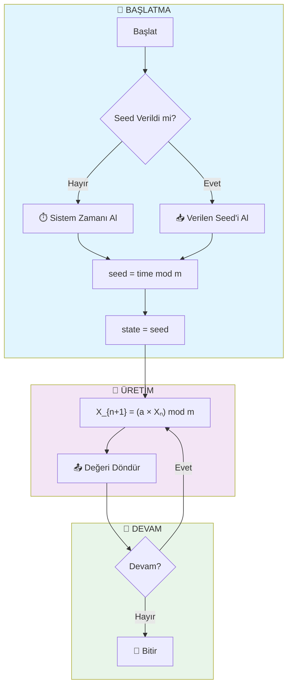
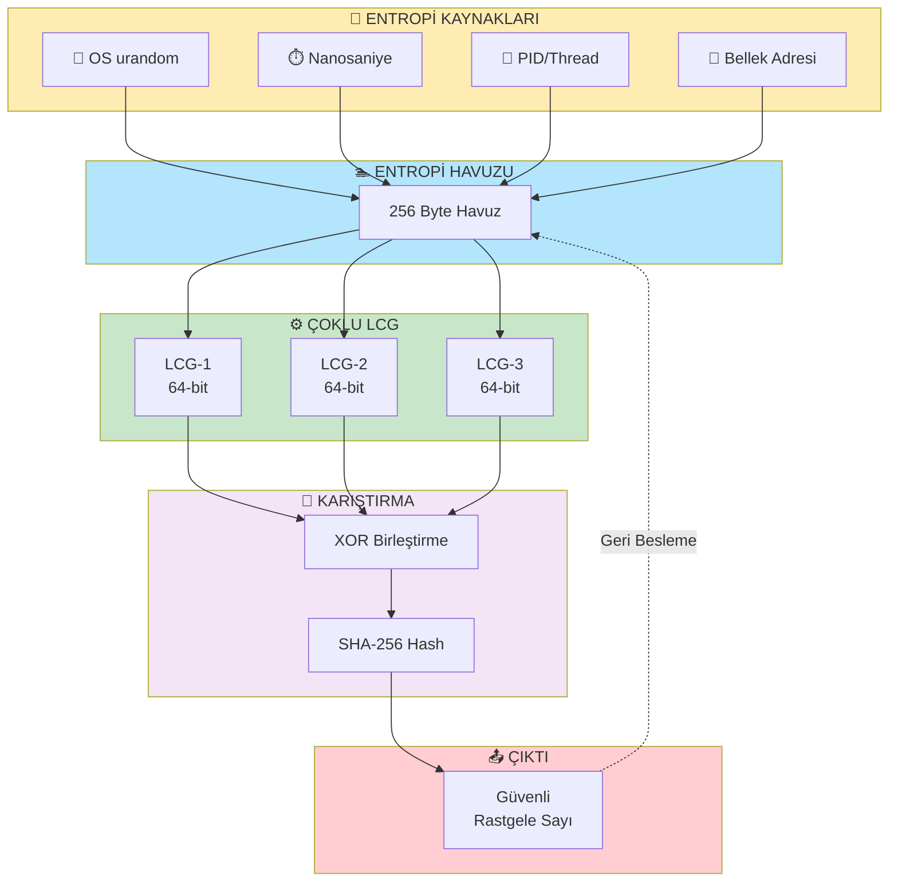
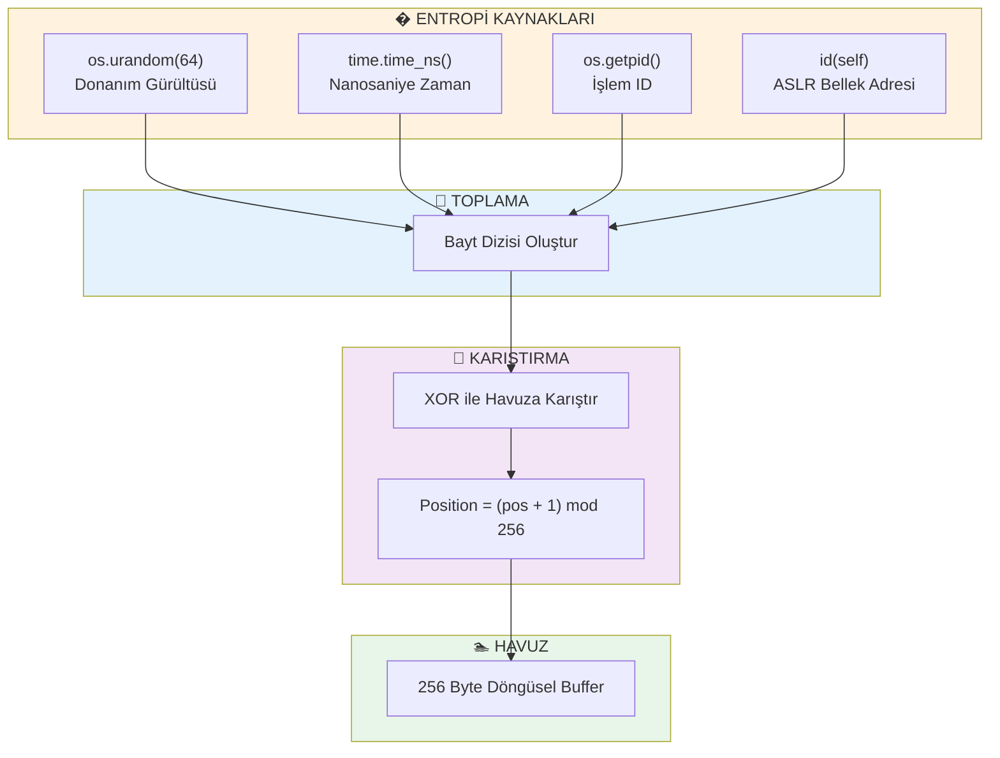
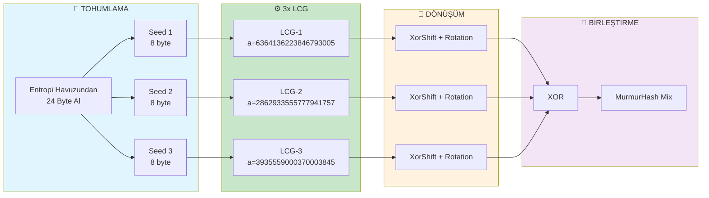
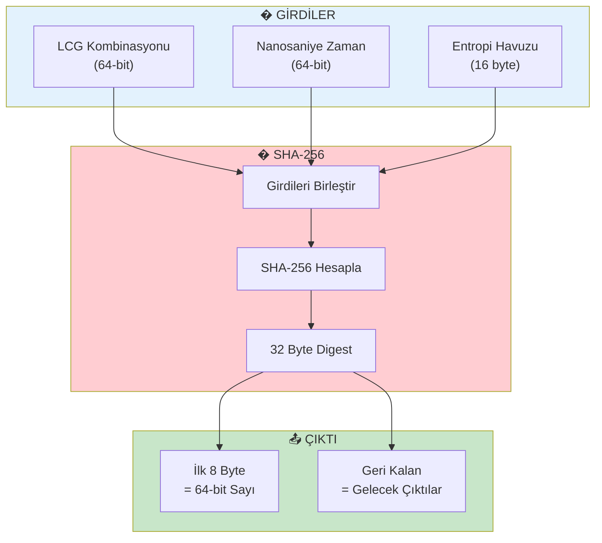
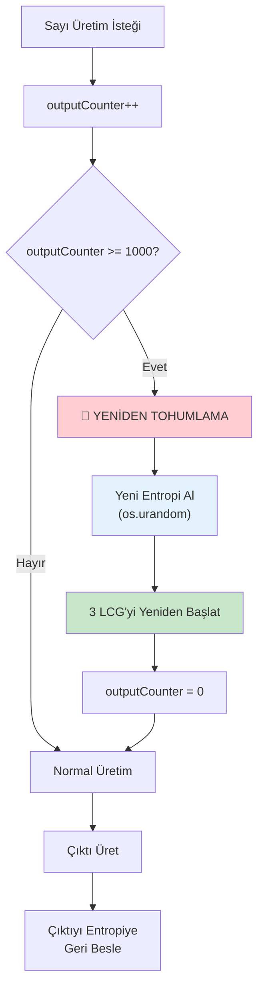
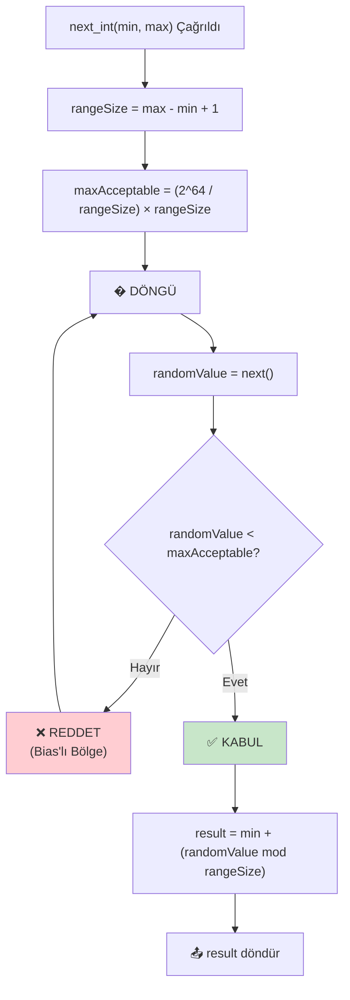
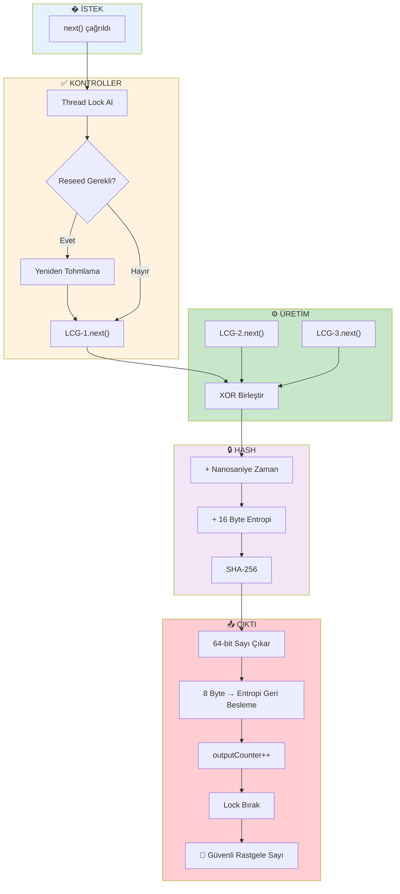
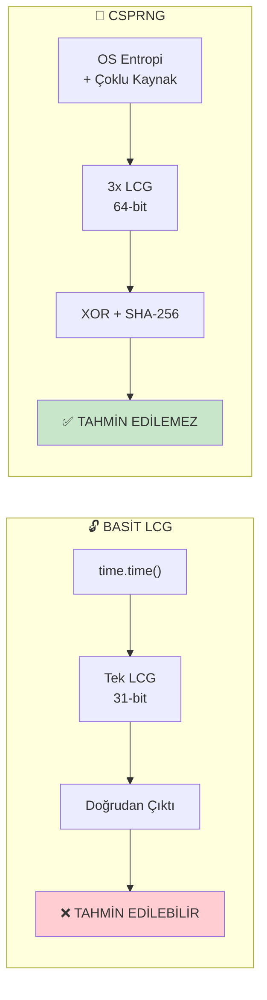

# 📊 Akış Şemaları (Flowcharts)
## LCG ve CSPRNG Algoritmaları

Bu dokümanda hem basit LCG hem de kriptografik güvenli CSPRNG algoritmasının akış şemaları bulunmaktadır.

---

# BÖLÜM 1: BASİT LCG

## 1.1 LCG Ana Algoritma Akışı

---

# BÖLÜM 2: KRIPTOGRAFİK GÜVENLİ CSPRNG

## 2.1 CSPRNG Genel Mimari

---

## 2.2 Entropi Havuzu Detayı

---

## 2.3 Çoklu LCG Kombinasyonu

---

## 2.4 SHA-256 Hash Karıştırma

---

## 2.5 Otomatik Yeniden Tohumlama

---

## 2.6 Modüler Bias Önleme (Rejection Sampling)

---

## 2.7 Tam Üretim Akışı

---

# BÖLÜM 3: KARŞILAŞTIRMA

## 3.1 LCG vs CSPRNG

---

## 📐 Şema Notasyonu

| Sembol | Anlam |
|--------|-------|
| ⬜ Dikdörtgen | İşlem / Komut |
| ◇ Eşkenar Dörtgen | Karar / Koşul |
| ⬭ Oval | Başlat / Bitir |
| ➡️ Ok | Akış Yönü |
| - - -> | Geri Besleme |
| 📦 Alt Grup | Modül / Bileşen |

---

*Bu akış şemaları Mermaid formatında hazırlanmıştır ve GitHub'da otomatik render edilir.*
