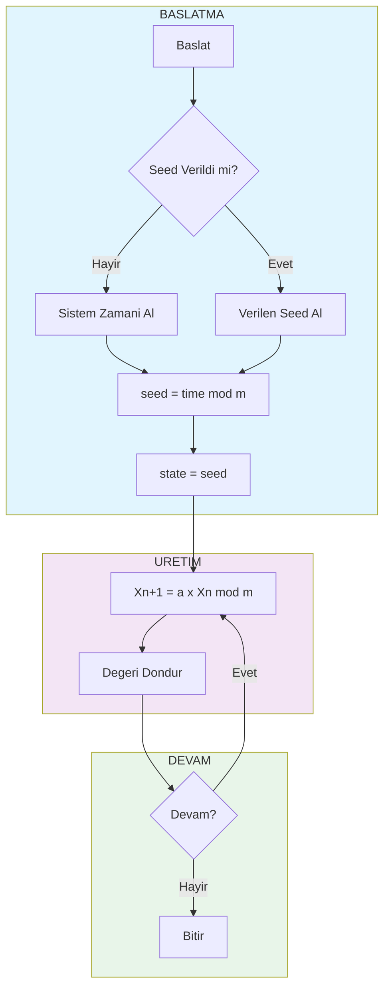
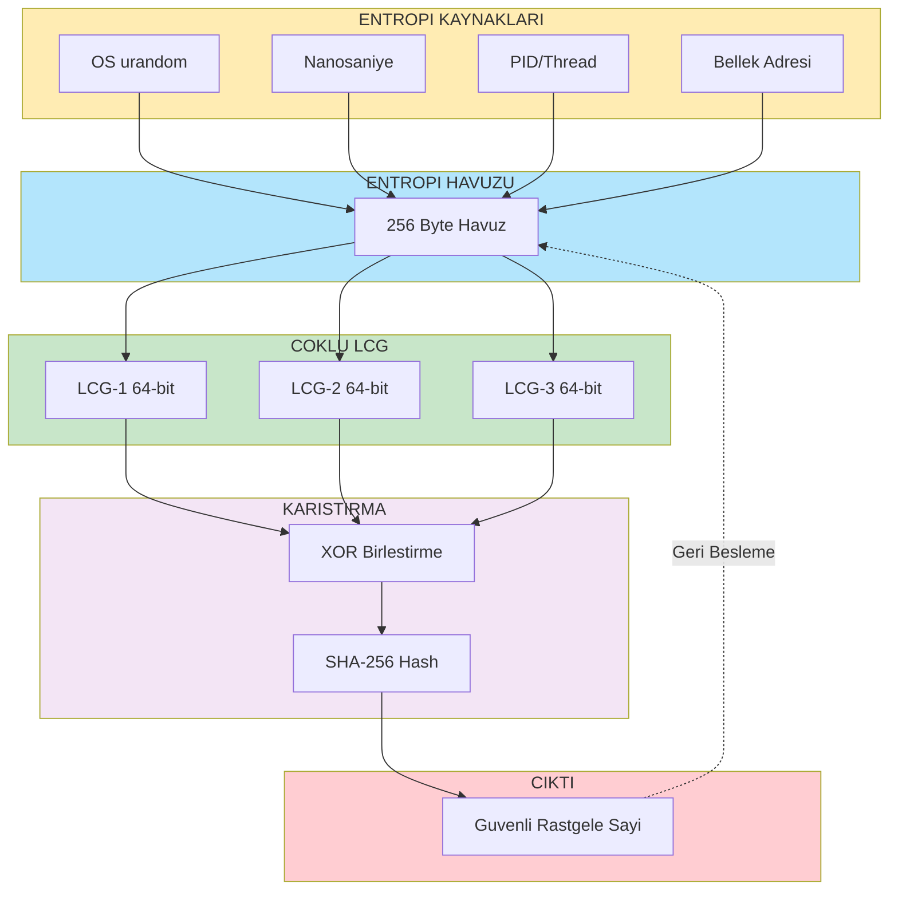
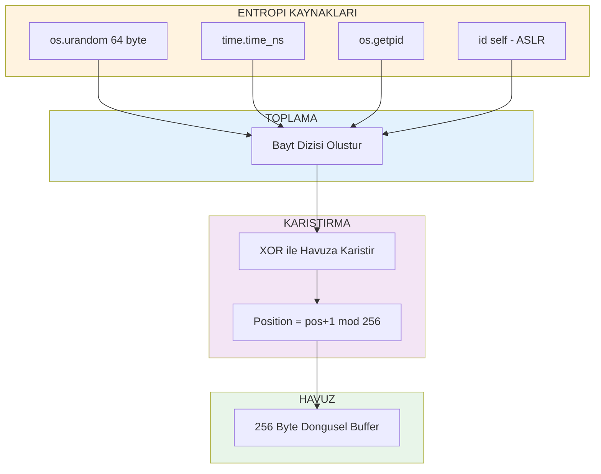
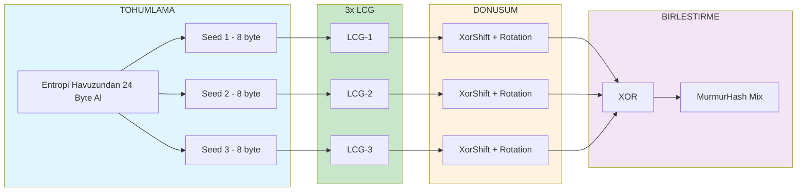
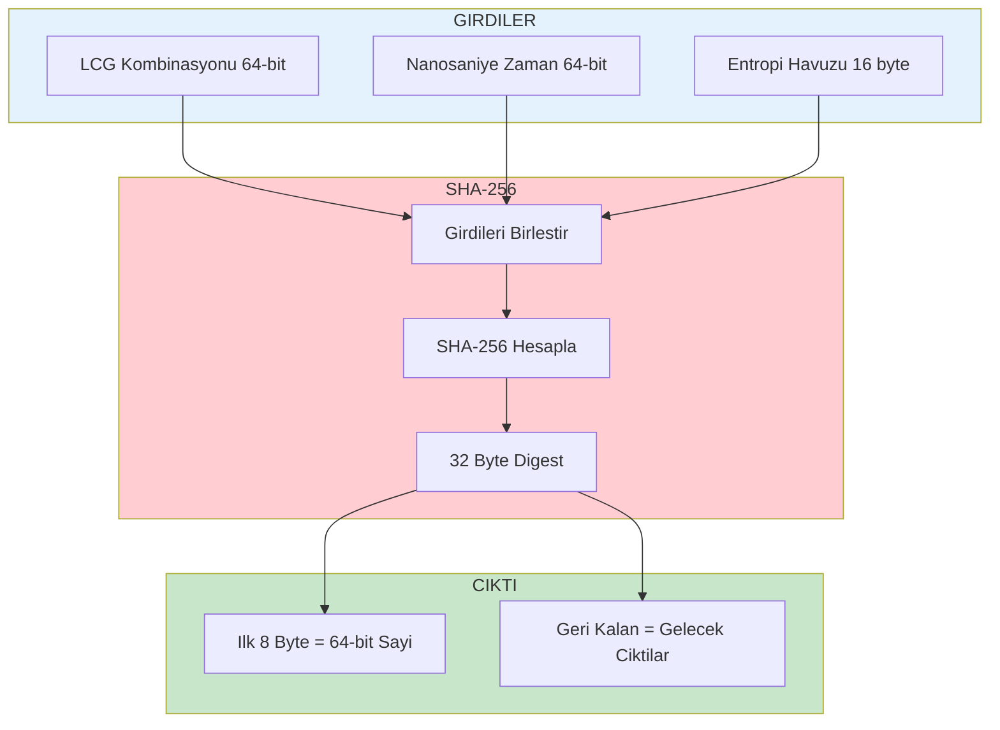
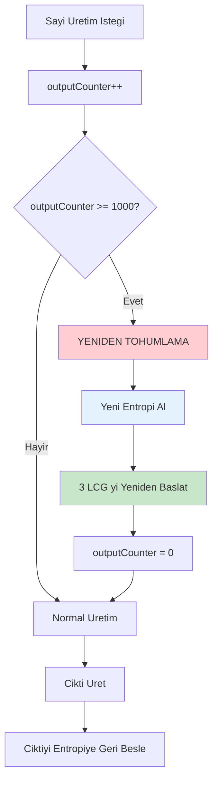
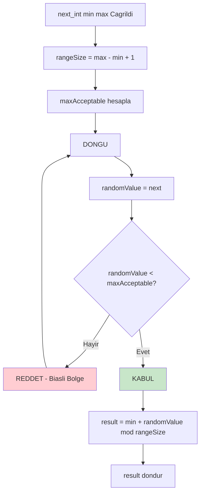
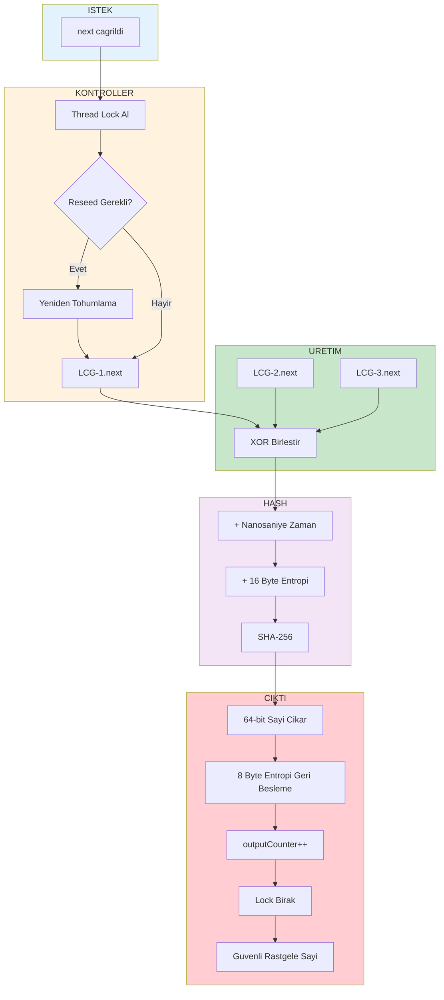
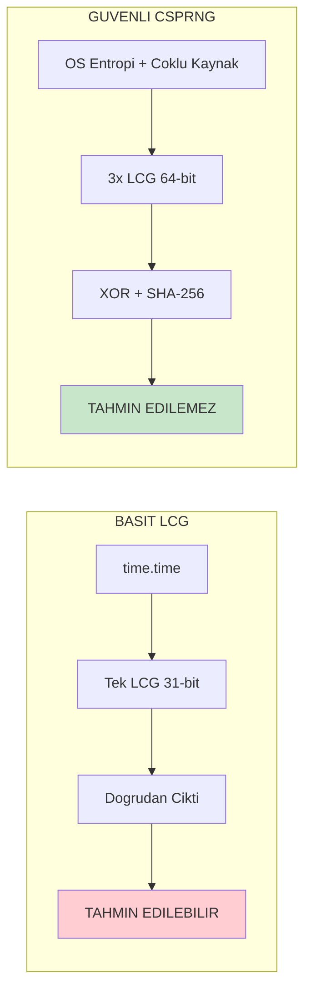

# Akis Semalari (Flowcharts)
## LCG ve CSPRNG Algoritmalari

Bu dokumanda hem basit LCG hem de kriptografik guvenli CSPRNG algoritmasinin akis semalari bulunmaktadir.

---

# BOLUM 1: BASIT LCG

## 1.1 LCG Ana Algoritma Akisi

---

# BOLUM 2: KRIPTOGRAFIK GUVENLI CSPRNG

## 2.1 CSPRNG Genel Mimari

---

## 2.2 Entropi Havuzu Detayi

---

## 2.3 Coklu LCG Kombinasyonu

---

## 2.4 SHA-256 Hash Karistirma

---

## 2.5 Otomatik Yeniden Tohumlama

---

## 2.6 Moduler Bias Onleme - Rejection Sampling

---

## 2.7 Tam Uretim Akisi

---

# BOLUM 3: KARSILASTIRMA

## 3.1 LCG vs CSPRNG

---

## Sema Notasyonu

| Sembol | Anlam |
|--------|-------|
| Dikdortgen | Islem / Komut |
| Eskenar Dortgen | Karar / Kosul |
| Oval | Baslat / Bitir |
| Ok | Akis Yonu |
| Kesikli Ok | Geri Besleme |
| Alt Grup | Modul / Bilesen |

---

*Bu akis semalari Mermaid formatinda hazirlanmistir ve GitHub da otomatik render edilir.*
