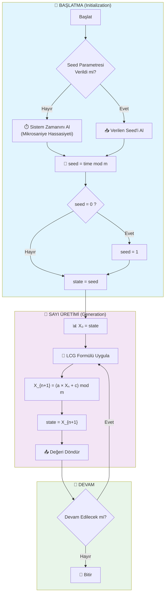
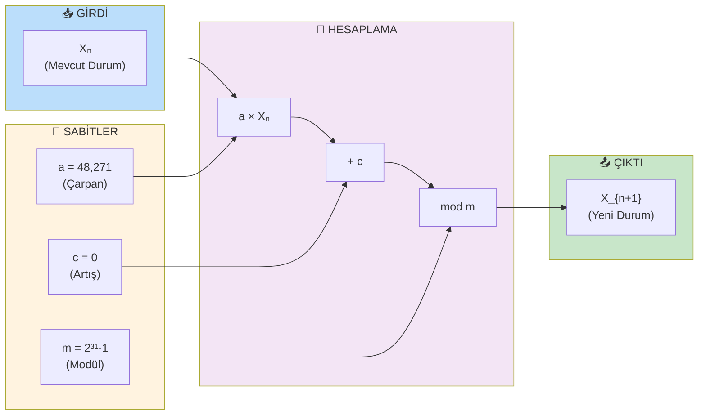
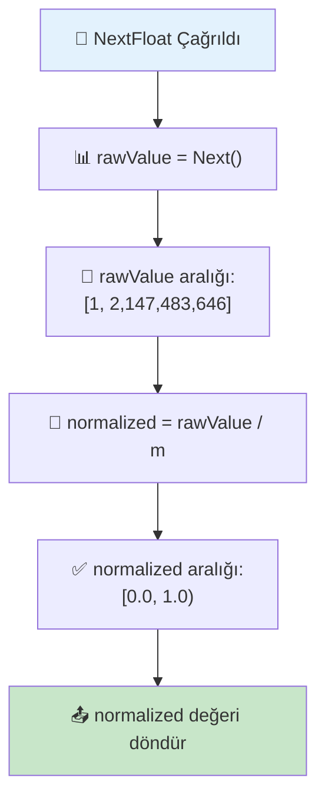
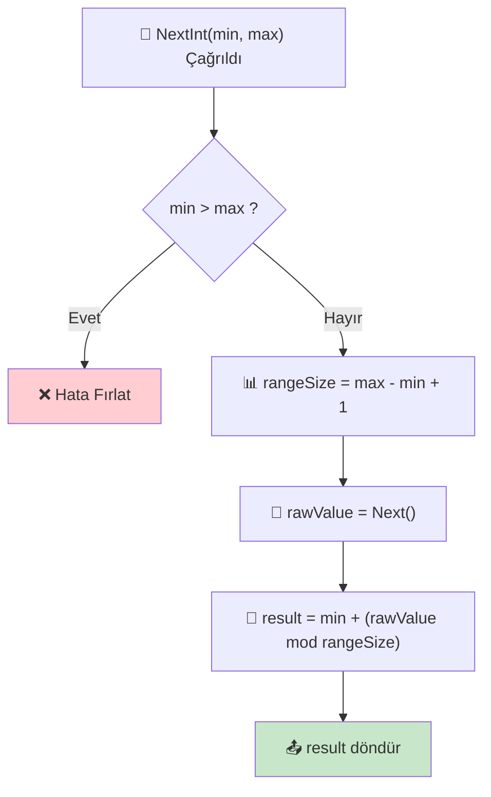
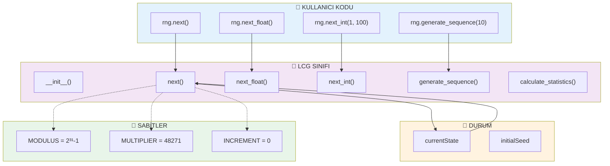
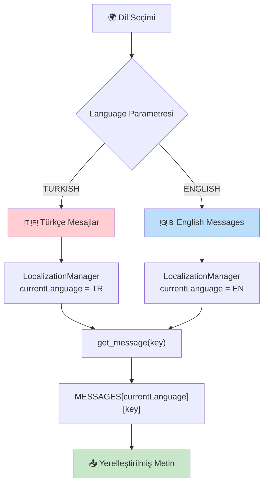
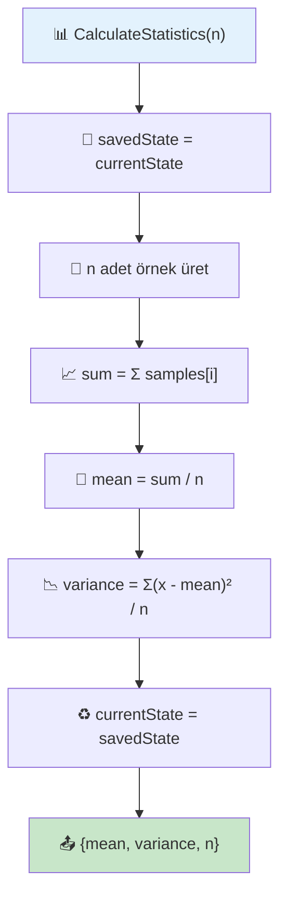
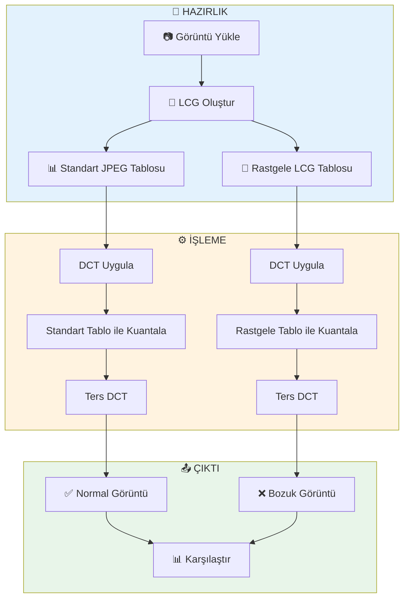

# 📊 Akış Şeması (Flowchart)
## Doğrusal Eşlik Üreteci (LCG) Algoritması

Bu dokümanda LCG algoritmasının farklı açılardan görselleştirilmiş akış şemaları bulunmaktadır.

---

## 1. Ana Algoritma Akışı

---

## 2. LCG Temel Formülü Detayı

---

## 3. Normalize Edilmiş Sayı Üretimi

---

## 4. Aralıkta Sayı Üretimi

---

## 5. Sistem Mimarisi

---

## 6. Dil Seçimi Akışı

---

## 7. İstatistiksel Test Akışı

---

## 8. JPEG Demo Akışı

---

## 📐 Şema Notasyonu

| Sembol | Anlam |
|--------|-------|
| ⬜ Dikdörtgen | İşlem / Komut |
| ◇ Eşkenar Dörtgen | Karar / Koşul |
| ⬭ Oval | Başlat / Bitir |
| ➡️ Ok | Akış Yönü |
| 📦 Alt Grup | Modül / Bileşen |

---

*Bu akış şemaları Mermaid formatında hazırlanmıştır ve GitHub'da otomatik render edilir.*
